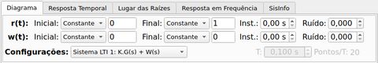
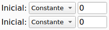
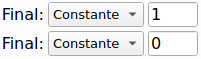
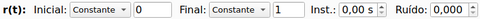
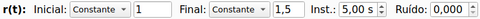
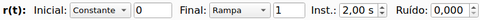

## Configuração das entradas

### Visão geral

As entradas para a resposta temporal do sistema selecionado são configuradas no topo da aba "Diagrama", conforme a imagem abaixo:

São duas entradas:
* r(t): entrada de referência
* w(t): entrada de perturbação

A localização dessas entradas pode ser vista no diagrama de blocos do sistema selecionado.

Cada entrada é composta por dois segmentos:

Na caixa *dropdown* pode ser escolhido o tipo de sinal. No campo ao lado é fornecido o valor de um parâmetro que tem siginificado variável, conforme o tipo escolhido:

| Tipo de sinal | Significado do parâmetro |
|--------|--------|
|Constante| Valor da constante |
|Rampa| Valor do coeficiente da rampa |
|Parábola| Valor do coeficiente da parábola |
|Seno| Valor da frequência do seno em Hz |
|Cosseno| Valor da frequência do cosseno em Hz |
|Custom| Esta funcionalidade ainda não foi implementada|

O sinal definido no segmento *Inicial* será utilizado do instante inicial (*t=0*) até o instante indicado no campo *Inst.*. Já o sinal definido no segmento *Final* será utilizado do instante dado por *Inst.* até o tempo máximo da simulação (este é definido na aba *Resposta Temporal*).

Se o valor de *Inst.* for 0, o segmento inicial não será considerado e o sinal de entrada resultante terá apenas um segmento (o segmento *Final*).

Vale lembrar que a condição inicial para a resposta no domínio do tempo é considerada nula. Ou seja, um valor constante diferente de zero no segmento *Inicial* significa um degrau com a amplitude dada iniciando em zero.

O campo ruído é usado para inserir um ruído gaussiano em todo sinal de entrada. O valor indicado é o desvio padrão do ruído com média 0 a ser somado ao sinal de entrada. Um valor nulo indica que o ruído não está sendo considerado.

Vejamos alguns exemplos.

### Exemplos

#### Degrau unitário inciando em t=0s

#### Degrau com variação em t=5s

#### Rampa unitária inicianto em t=2s

